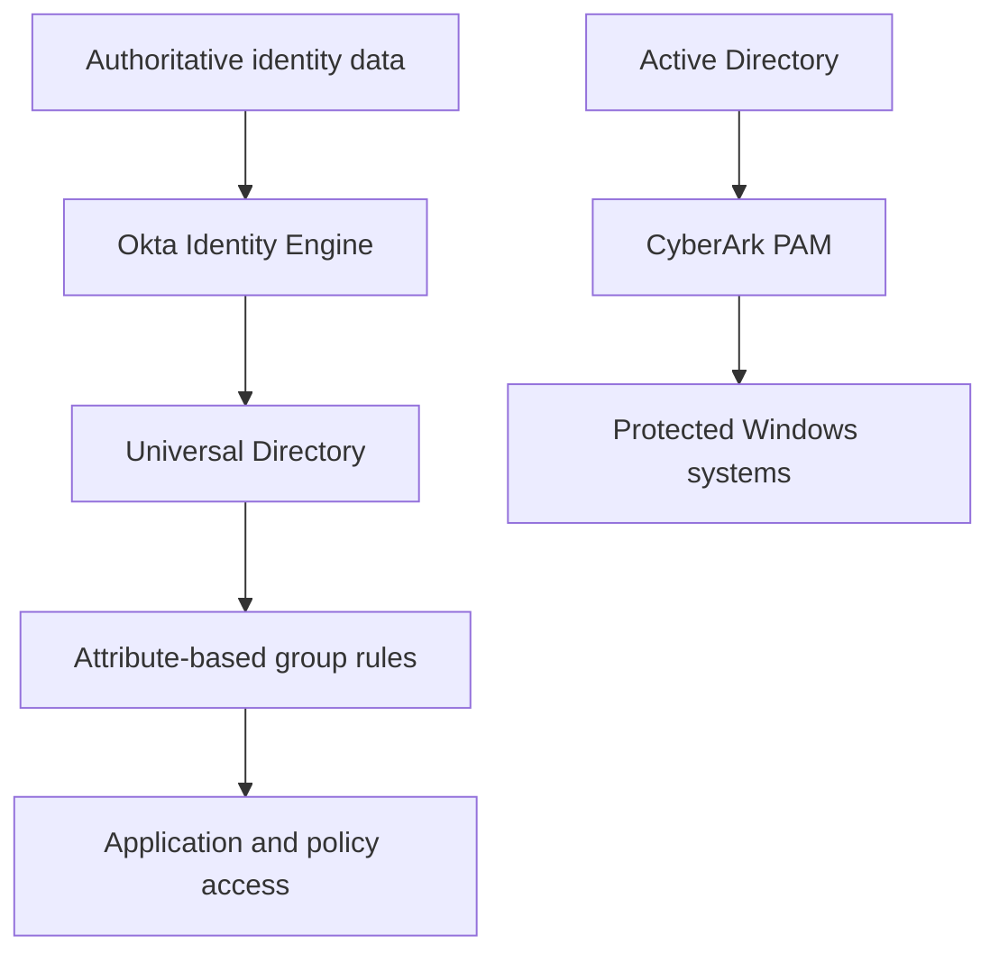

# TechMigos Enterprise IAM & PAM Lab

An enterprise-style identity security portfolio demonstrating workforce identity administration, lifecycle automation, access-policy design, Active Directory integration, and privileged access management.

## Project objective

TechMigos is a simulated organization used to build and document realistic IAM and PAM workflows. The lab focuses on the controls an identity team would operate in production: identity data quality, least-privilege access, automated joiner-mover-leaver processes, administrative separation of duties, and protected privileged sessions.

## Portfolio projects

| Project | Business outcome | Skills demonstrated |
|---|---|---|
| [Okta Organization Setup](projects/01-okta-organization-setup) | Establishes the workforce identity tenant, administrative model, and group structure | Okta Identity Engine, delegated administration, group design |
| [Profile Editor & Attribute Mapping](projects/02-profile-editor-and-attribute-mapping) | Creates consistent identity profiles and application-ready attributes | Universal Directory, custom attributes, Okta Expression Language, source-of-truth design |
| [User Lifecycle Management](projects/03-user-lifecycle) | Automates access changes across joiner, mover, and leaver events | Group rules, provisioning logic, lifecycle states, access removal |
| [Security Policies](projects/06-security-policies) | Applies stronger controls according to user, resource, and risk context | MFA, authentication policies, session controls, least privilege |
| [CyberArk Privileged Access Management](cyberark-pam) | Protects privileged Windows accounts and brokers controlled administrative sessions | CyberArk Vault, PVWA, CPM, PSM, Safes, PSM-RDP, Active Directory |

## Architecture

## Core scenarios

- **Joiner:** Create an identity, populate required attributes, apply group rules, and grant policy-based access.
- **Mover:** Change department or employment attributes and verify that access adjusts automatically.
- **Leaver:** Suspend or deactivate the identity and validate access removal.
- **Privileged administrator:** Store a privileged account in a CyberArk Safe and broker an audited administrative session through PSM.
- **Policy enforcement:** Apply MFA and session requirements based on the user population and protected resource.

## Security design principles

- Least privilege and separation of duties
- Group-based access instead of direct user assignment
- Attribute-driven lifecycle automation
- Strong authentication for sensitive resources
- Controlled use of privileged credentials
- Auditability through system events, session records, and test evidence

## Technology stack

`Okta Identity Engine` · `Okta Universal Directory` · `Active Directory` · `CyberArk PAM` · `PVWA` · `CPM` · `PSM` · `PowerShell` · `MFA`

## Documentation standard

Each project is designed to include:

1. Business requirement and intended control
2. Architecture or access-flow explanation
3. Configuration evidence
4. Test cases with expected and actual results
5. Troubleshooting notes
6. Security impact and lessons learned

## Current development focus

The Okta environment is being rebuilt into a cleaner enterprise model with standardized department, role, application-access, location, and employment-type groups. New documentation will emphasize repeatable test cases and measurable access outcomes.

> All identities, systems, hostnames, and network information shown in this repository belong to an isolated personal training environment. Secrets and authentication material are excluded.
