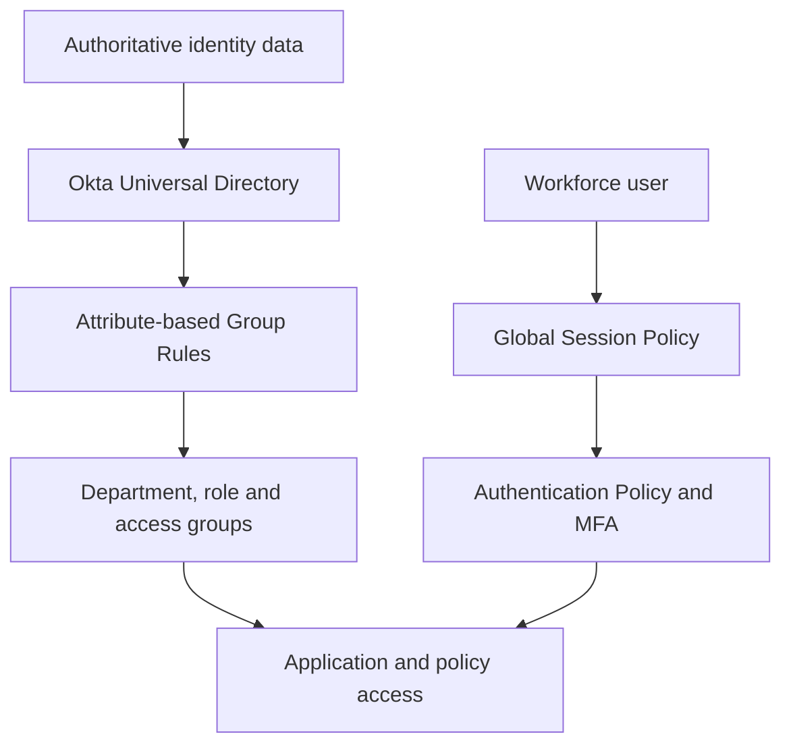

# TechMigos Enterprise Okta IAM Lab

A hands-on Okta Identity Engine portfolio demonstrating workforce identity administration, Universal Directory, lifecycle automation, group-based access, delegated administration, and adaptive security policies.

## Business scenario

TechMigos is a simulated enterprise rebuilding its identity environment around Okta. The goal is to replace manual identity administration with standardized profiles, automated access decisions, least-privilege administration, and measurable security controls.

## Okta project portfolio

| Project | Business problem | Okta capabilities |
|---|---|---|
| [01 — Organization & Group Architecture](projects/01-organization-group-architecture) | Establish a governed tenant and scalable access structure | Identity Engine, groups, admin roles, System Log |
| [02 — Universal Directory & Profile Governance](projects/02-universal-directory-profile-governance) | Create consistent, policy-ready identity data | Profile Editor, custom attributes, OEL, mappings |
| [03 — Joiner-Mover-Leaver Automation](projects/03-joiner-mover-leaver-automation) | Automate access as employment data changes | Group Rules, lifecycle states, assignments |
| [04 — Adaptive Access & MFA Policies](projects/04-adaptive-access-mfa-policies) | Apply stronger authentication according to context | Authenticators, global session policies, app policies, network zones |

## Architecture

## Enterprise scenarios demonstrated

- **Joiner:** Create a user with standardized attributes and automatically grant baseline access.
- **Mover:** Change department, title, location, or employment type and validate access recalculation.
- **Leaver:** Suspend and deactivate the identity, then confirm access is removed.
- **Help-desk administrator:** Delegate limited support permissions without granting Super Administrator.
- **Privileged Okta administrator:** Require stronger authentication for Admin Console access.
- **Untrusted network:** Apply step-up authentication or shorter sessions outside trusted zones.

## Okta competencies

`Identity Engine` · `Universal Directory` · `Profile Editor` · `Okta Expression Language` · `Group Rules` · `Delegated Administration` · `Authenticators` · `MFA` · `Global Session Policies` · `Authentication Policies` · `Network Zones` · `System Log`

## Validation method

Each project documents:

1. Business requirement
2. Identity or access design
3. Configuration decisions
4. Positive and negative test cases
5. Expected and actual results
6. System Log evidence
7. Risks, limitations, and production improvements

## Current focus

The active rebuild standardizes department, role, application-access, location, and employment-type groups. The next phase adds repeatable JML testing, policy verification, and clean evidence for every control.
