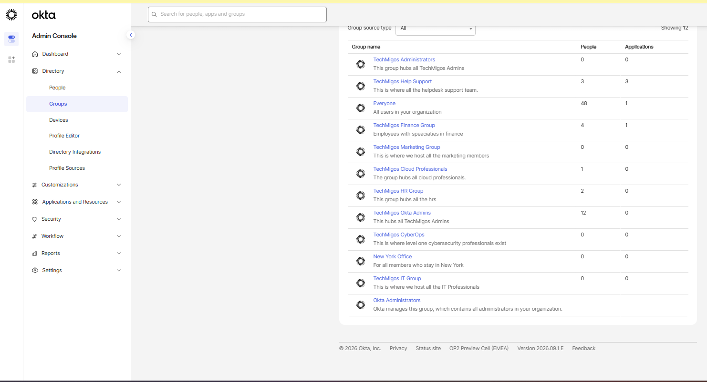
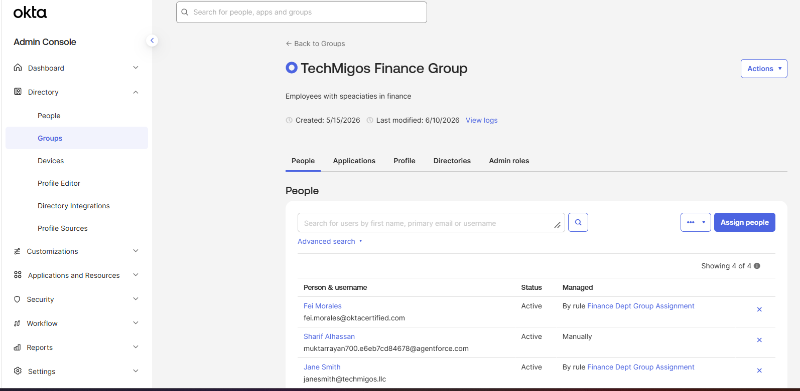
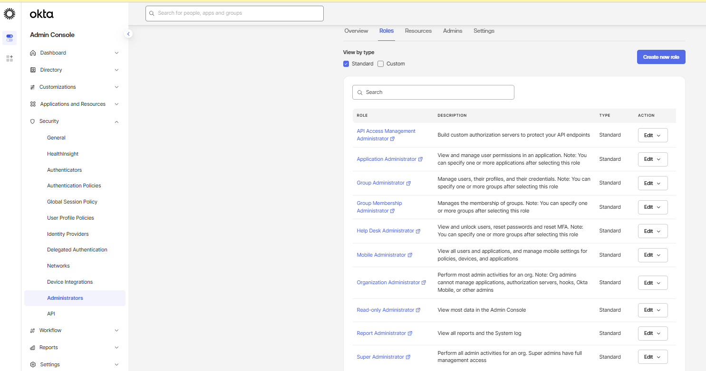
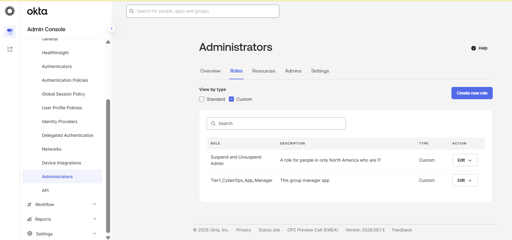

# 01 — Okta Organization & Group Architecture

## Business requirement

I modeled TechMigos as an enterprise that needed a governed Okta Identity Engine tenant without inconsistent group assignments or excessive administrator privilege.

## What I completed

- I activated and reviewed the Okta Identity Engine tenant.
- I organized access around department, role, location, and administration.
- I created clear group names and descriptions.
- I reviewed administrator access using a least-privilege approach.
- I prepared the tenant for attribute-driven automation.

## Group architecture I created

| Category | Examples | What I accomplished |
|---|---|---|
| Department | TechMigos Finance Group, Marketing Group, HR Group | I represented the organizational structure. |
| Role | Help Support, Cloud Professionals, CyberOps | I represented job functions across departments. |
| Administration | TechMigos Administrators, Okta Admins | I separated administrative access from workforce access. |
| Location | New York Office | I prepared location-based assignments. |

## Implementation summary

1. I verified administrator access to the tenant.
2. I reviewed Directory, Security, Reports, and System Log functions.
3. I created department, function, location, and administrative groups.
4. I added descriptions explaining each group's purpose.
5. I assigned test users manually and through a Finance group rule.
6. I verified the resulting membership.

## Validation results

| Test I performed | Result I observed |
|---|---|
| I reviewed the complete group directory. | The groups appeared with descriptions, people counts, and application counts. |
| I opened the Finance group and reviewed its members. | Four active users appeared with rule-managed and manual assignments. |

## Evidence

### Group directory

**What I proved:** I created and documented the TechMigos group architecture.

### Finance group membership

**What I proved:** I verified active Finance members and confirmed rule-based and manual assignments.

### Standard administrator roles

**What I proved:** I reviewed Okta's built-in administrator roles and compared their responsibilities before selecting least-privilege options.

### Custom administrator roles

**What I proved:** I created custom administrator roles for limited operational responsibilities instead of relying only on Super Administrator access.

## Production improvements I would make

- I would assign a formal owner and review date to every group.
- I would replace broad administrator access with delegated roles.
- I would perform periodic access reviews and retain System Log evidence.

