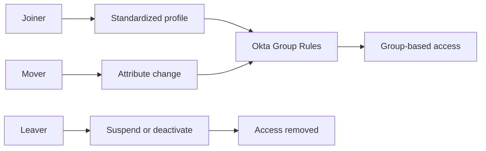

# 03 — Okta Joiner-Mover-Leaver Automation

## Business requirement

Manual group assignment does not scale and creates inconsistent access. TechMigos needs attribute-driven lifecycle controls that grant, adjust, and remove access as a user's employment data changes.

## Lifecycle flow

## Implemented group-rule logic

| Rule | Condition | Result |
|---|---|---|
| Finance membership | `user.department == "Finance"` | Add to Finance group |
| Marketing membership | `user.department == "Marketing"` | Add to Marketing group |
| HR membership | HR department or approved HR title | Add to HR group |
| Cloud role | Approved cloud title | Add to Cloud Professionals |
| Employee baseline | `user.userType == "Employee"` | Add to employee baseline group |
| Contractor control | `user.userType == "Contractor"` | Add to contractor group |
| New York location | `user.city == "New York"` | Add to New York location group |

The earlier administrator rule based only on an email-domain match was disabled after testing because its condition was too broad for privileged access. Administrator membership should use a controlled approval process rather than a general profile rule.

## Joiner test

1. Create a user with department, title, employment type, and location.
2. Activate the identity.
3. Allow group rules to evaluate.
4. Verify expected department, employment-type, and location groups.
5. Confirm unrelated groups are not assigned.
6. Review user creation and group membership events in the System Log.

## Mover test

1. Record the user's existing access.
2. Change the department or job title.
3. Verify the old rule-based membership is removed.
4. Verify the new membership is added.
5. Confirm direct assignments are reviewed separately.
6. Validate the complete change in the System Log.

## Leaver test

1. Suspend the user to block new authentication while preserving the account.
2. Verify application access is unavailable.
3. Deactivate the user when offboarding is approved.
4. Confirm assignments and active sessions are addressed.
5. Delete only when retention and recovery requirements permit it.
6. Review the offboarding events in the System Log.

## Test matrix

| Scenario | Positive result | Negative check |
|---|---|---|
| Finance employee joins | Finance and employee groups assigned | Marketing and contractor groups absent |
| Employee moves to IT | IT membership added | Previous Finance membership removed |
| Contractor becomes employee | Employee baseline assigned | Contractor membership removed |
| User is suspended | New sign-in blocked | Account is not silently deleted |
| User is deactivated | Access removed | No active application assignment remains unnoticed |

## Controls demonstrated

- User creation and activation
- Profile updates
- Attribute-based Group Rules
- Group-based access assignment
- Suspension and reactivation
- Deactivation and deletion
- System Log validation
- Exception awareness for direct assignments

## Outcome

The lifecycle process moves TechMigos from manual membership management to repeatable, attribute-driven JML operations. Tests cover both intended access and the absence or removal of access.

## Production improvements

- Source lifecycle events from an HR system
- Add manager-based approval for sensitive access
- Maintain exception groups with owners and expiration dates
- Monitor failed rule evaluation and deprovisioning events
- Run periodic access certification
