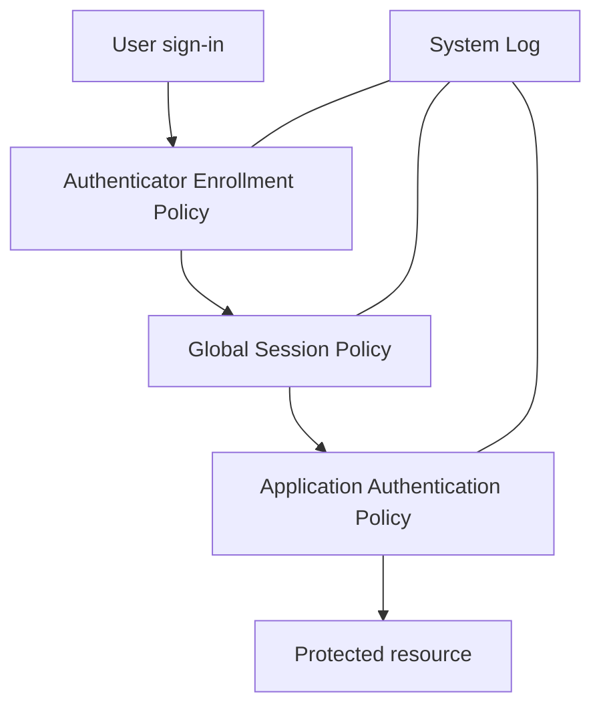

# 04 — Okta Adaptive Access & MFA Policies

## Business requirement

TechMigos needs consistent authentication controls that protect ordinary workforce access while applying stronger requirements to administrators, sensitive resources, and untrusted network contexts.

## Policy layers

## Control design

| Layer | Purpose | TechMigos design |
|---|---|---|
| Authenticator enrollment | Defines available and required factors | Require strong authenticators for workforce users; maintain recovery options |
| Global session policy | Determines whether an Okta session can be established | Differentiate trusted and untrusted access; require MFA when risk increases |
| Application authentication policy | Protects a specific resource | Apply stronger assurance to the Admin Console and sensitive applications |
| Network zones | Supplies network context | Maintain trusted and untrusted zones with documented test addresses |
| Behavior detection | Identifies unusual sign-in context | Use signals such as a new city or device when available |
| System Log | Provides evidence and troubleshooting | Validate rule matches, challenges, failures, and policy outcomes |

## Policy inventory

### Company Access Policy

Baseline policy for workforce access:

- Allow expected workforce identities
- Require authentication with approved authenticators
- Apply shorter or stronger sessions when access is untrusted
- Deny access that fails the required assurance level

### Privileged Admin Console Access

Higher-assurance policy for administrative access:

- Target the Okta Admin Console
- Limit access to approved administrator populations
- Require phishing-resistant or the strongest available MFA option
- Prompt more frequently than standard workforce applications
- Log and review failed administrative access attempts

### Authenticator Enrollment Policy

- Define required and optional authenticators
- Prevent weak recovery paths from undermining stronger policies
- Test new-user enrollment and existing-user migration
- Maintain an emergency recovery procedure for the lab

## Rule ordering

Okta evaluates policy rules by priority. Specific high-risk rules must appear above broad catch-all rules.

Recommended order:

1. Block explicitly prohibited conditions
2. Protect administrators and sensitive resources
3. Challenge untrusted or anomalous access
4. Allow trusted standard workforce access
5. Apply a final catch-all rule

## Validation matrix

| Test | Context | Expected result |
|---|---|---|
| Standard workforce sign-in | Trusted network, registered authenticator | Access granted according to baseline rule |
| Untrusted-network sign-in | Outside trusted zone | Step-up authentication or stricter session control |
| Admin Console access | Approved admin user | Strong MFA required |
| Unauthorized admin attempt | Non-admin user | Access denied and logged |
| Missing required authenticator | User not enrolled | Enrollment or access block according to policy |
| Repeated failed authentication | Incorrect factor | Failure recorded in the System Log |
| Unrecognized city behavior | New geographic context | Behavior signal influences the matching policy when configured |
| Session expiration | Maximum lifetime reached | Reauthentication required |

## System Log verification

For every test, record:

- Test user
- Timestamp
- Target resource
- Network or behavior context
- Policy and rule matched
- Authenticator requested
- Result: allow, challenge, or deny
- Relevant System Log event and outcome

Useful investigation questions:

- Which rule evaluated first?
- Did the user belong to the expected group?
- Was the network zone classified correctly?
- Was the required authenticator enrolled?
- Did the application use the intended authentication policy?
- Does the System Log show a policy denial or an authenticator failure?

## Security risks addressed

- Excessive administrator access
- Weak or inconsistent MFA
- Broad catch-all rules overriding specific controls
- Long-lived sessions on untrusted networks
- Incorrect network-zone classification
- Missing evidence for access decisions

## Outcome

This project documents how TechMigos designs, orders, tests, and troubleshoots Okta security policies. The emphasis is not only creating rules, but proving which rule matched and whether the resulting access decision met the business requirement.

## Production improvements

- Deploy phishing-resistant authenticators
- Integrate device assurance and endpoint posture
- Forward System Log events to a SIEM
- Establish emergency-access and recovery procedures
- Review policy rules and exclusions on a scheduled basis
- Test changes in a non-production tenant before rollout
